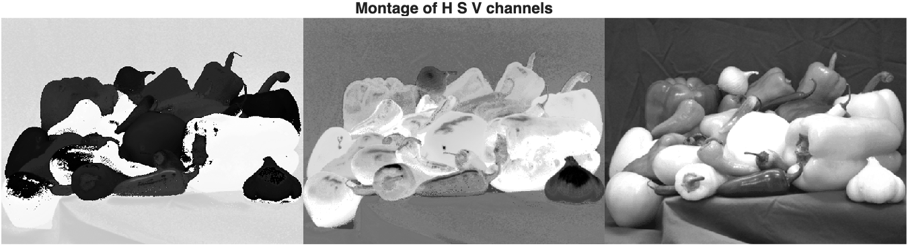

# Lab 2 - Colour and Perception
*_Peter Cheung, version 1.1, 22 Jan 2026_*

This lab session has two parts. In the first part, you will experiment with various physiological and psychological phenomenons related to your vision, colour perception and how the brain makes up missing visual information.  In the second part, you will explore how colour images are separated into different colour spaces.

Clone this repo to your laptop and do all your work using your local copy.

---
## Part 1 - Seeing Colours and Shapes
---

### Task 1 - Find your blind spot

Play the video [here](http://www.ee.ic.ac.uk/pcheung/teaching/DE4_DVS/assets/blind_spot_test.mp4) and follow its instructions.  Make notes on what you found out.

<video src="./Lab2-Colour-Perception-main/assets/blind_spot_test.mp4" width="480" height="360" controls></video>

Really cool. I found it very easy to find my blind spot (I've been doing it my whole life)

### Task 2 - Ishihara Colour Test

The Ishihara test is a colour vision test designed to detect deficiencies in the long and medium cones.  It consists of one set of pictures containing colour dots with a number embedded within.  Your goal is to identify the number you see in each of them.

You can start the test [here](Ishihara_test.md).

Yep, no colorblindness here. 
`74 6 16 2 29 7 45 5 97 8 42 3`

### Task 3 - Reverse colour

1. Get hold of a white sheet of paper and hold it up next to your screen.  
2. Now stare at white dot in the centre of the American flag in funny colours shown below for 10 seconds or more.  
3. Suddenly switch your gaze to the white sheet of paper.

You should see the American flag in the normal red, white and blue colours.

<p align="center">  </p><BR>

Explain the reasons why this happens.

**Answer:**

> While you stare at the image, your neurons are constantly over the threshold of activation (leading to the visual cortex perceiving color). As you stare longer, your neurons in charge of perceiving the original colors become fatigued, and their thresholds rise. When you switch to staring at the white sheet, with many wavelengths of light hitting your eyes, the fatigued neurons (with raised thresholds) don't all get activated, which reduces how much the original color scheme is perceived. The result: the inverse colors are emphasized. 

### Task 4 - Troxler's Fading

Here is another example to demonstrate the Opponent Process Theory.  Play the video [here](http://www.ee.ic.ac.uk/pcheung/teaching/DE4_DVS/assets/purple_dots.mp4) and follow the instruction.  

<video src="./Lab2-Colour-Perception-main/assets/purple_dots.mp4" width="640" height="320" controls></video>

Write down in your logbook the reason of what you see.  Read the wikipedia page on Troxler's fading [here](https://en.wikipedia.org/wiki/Troxler%27s_fading), which explains this phenomenon and relates it to the human visual system.

> Another example of neural adaptation. If you stare long enough at the same point, the faint color circles stay stationary in your visual field, and the exact same neurons fire again and again. These become desensitised, and actually stop firing (making the colors seem to fade). This is why 'saccades' (rapid shaking of the eye) is important, to avoid the same neurons becoming fatigued. 

[Here](http://www.ee.ic.ac.uk/pcheung/teaching/DE4_DVS/assets/blue_circle.mp4) is another experiment to test the phenomenon.  Play the video and comment.

<video src="./Lab2-Colour-Perception-main/assets/blue_circle.mp4" width="640" height="320" controls></video>

> Oh interesting. I originally thought this effect was simply the result of neural adaptation. But this video also pointed out that our brain tends to interpolate data and may simply be "tricked" into thinking the majority white of the screen is unbroken by color. So this is not only a phenomenon in our light receptors (cones and rods) but also perhaps in our visual cortex or further down in our cognitive processes.

### Task 5 - Brain sees what it expects

Our brain interprets what we see based on our expectation.  Here is an example.  The image below shows two tables with blue and red tops.  Which is the longer table?  Measure this on the screen with a ruler (or just marking on a sheet of paper).  Write in your logbook the reason for this phenomenon.

<p align="center">  </p><BR>

> They're the same length! that is: w(red) === h(blue). It seems this is just an illusion based on our expectations from what we see. The left table is "longer" relatively.


Here is another example, where our brain see what it expects instead of what hits the retina.  Which square is darker, the one labelled A or B?  Why?

<p align="center">  </p><BR>

To verify the result, you need to use an image editor app and cut out one square and put it next to the other for comparison.

> Image editor says that color of square A is rgb(111,111,111). Color of square B is also rgb(111,111,111)! Seems this is just an optical illusion where we interpret a color as lighter because it's in the context of shade.

### Task 6 - The Grid Illusion

When you stare at the centre of the grid below, you should see black dots at the intersection appearing and disappearing.  You can read more about it [here](https://en.wikipedia.org/wiki/Grid_illusion).

<p align="center">  </p><BR>

### Task 7 - Cafe Wall Illusion

Do you see the following brick wall layers are parallel?  Then measure the boundaries of each layer with a ruler.

<p align="center">  </p><BR>

This phenomenon is not observed for the following image when the contrast is lower.

<p align="center">  </p><BR>

You can find out more about this [here](https://en.wikipedia.org/wiki/Café_wall_illusion).


### Task 8 - the Silhouette Illusion

[Here](http://www.ee.ic.ac.uk/pcheung/teaching/DE4_DVS/assets/dancer.m4v) is video of a spinning dancer.  Play the video and looking at it for some time, you may find that the dance would suddenly spinning in the opposite direction.  The explanation for this phenomenon can be found [here](https://en.wikipedia.org/wiki/Spinning_dancer).

<video src="./Lab2-Colour-Perception-main/assets/dancer.m4v" width="640" height="640" controls></video>

> Nice

### Task 9 - the Incomplete Triangles

The last task in part 1 is to consider the picture below.  How many triangles are in the picture?  What conclusions can you draw from this observation?

<p align="center">  </p><BR>

> It looks like 2 triangles, even though really I can see that there are 0 explicit, real triangles. My interpretation of this is that: the brain extrapolates HARD from given visual stimuli. It can interpolate data between missing sections, perceive negative space as real objects, and more... What we see really is not what necessarily exists.

---
## Part 2 - Exploring Colours in Matlab
---

In the second part of Lab 2, you will import a full colour image from a file and map this to various colour spaces.  You will then examine what each of the components (or channels) in these colour spaces.  

### Task 10 - Convert RGB image to Grayscale

Although full colour images contain more information than grayscale images, we often find that they contain too much information and require unnecessary calculations. Instead it may be better to turn the colour image into a grayscale image before we perform various processing such as feature extraction.

Run Matlab and navigate the current working folder to the matlab folder of Lab 2.  (You do this with the icon  at the top left of the Matlab window).  The photo **peppers.png** is already stored in this folder.  Find out information about this photo file with **imfinfo( )**:
```
imfinfo('peppers.png')
```
Matlab will return some information about this image file such as its size and the format of the image data.

>E.g. Width: 777, Height: 584

Read the image data into the array RGB and display it:(*_Remember to add the semicolon at the end of the imread statement to suppress printing of all the image data read._*)
```
RGB = imread('peppers.png');  
imshow(RGB)
```
In this task, we will convert the RGB image into a grayscale image. The formula to perform this mapping is:
```
    I = 0.299 * R + 0.587 * G + 0.114 * B 
```

In matrix form, it is:

<p align="center">  </p>

The function **rgb2gray( )** converts RGB values to grayscale values by forming a weighted sum of the R, G, and B components according to the equation above. 

```
I = rgb2gray(RGB);
figure              % start a new figure window
imshow(I)
```

It would easier to compare the two photo if we display them side-by-side with **imshowpair( )** and add a title. This can be done with:

```
imshowpair(RGB, I, 'montage')
title('Original colour image (left) grayscale image (right)');
```

> Done ✅

### Task 11 - Splitting an RGB image into separate channels

Split the image into its red, green, and blue channels with **imsplit( )**. Then display all three images side-by-side as a montage.

```
[R,G,B] = imsplit(RGB);
montage({R, G, B},'Size',[1 3])
```

Note the following: Red peppers have a signal predominantly in the red channel. Yellow and green peppers have a signal in both the red and green channels. White objects, such as the garlic in the foreground, have a strong signal in all three channels.

Examine the information shown on the right side of the Matlab window. Explain their dimensions and data type of the variables RGB, R, G, B and I.

> RGB: a 584 X 777 X 3 matrix (Y, X, RGB). Each cell stores a value from 0-255 representing the red, green, or blue channel value at that pixel.
> 
> R: a 584 X 777 matrix (Y, X). Each cell stores a value from 0-255 representing the intensity of the red channel at that pixel.
>
> G: a 584 X 777 matrix (Y, X). Each cell stores a value from 0-255 representing the intensity of the green channel at that pixel.
>
> B: a 584 X 777 matrix (Y, X). Each cell stores a value from 0-255 representing the intensity of the blue channel at that pixel.
> 
> I: a 584 X 777 matrix (Y, X). Each cell stores a value from 0-255 representing a weighted average of each color channel at that pixel (0.299 * R + 0.587 * G + 0.114 * B).

### Task 12 - Map RGB image to HSV space and into separate channels

Convert the RGB image to the HSV colorspace by using the **rgb2hsv( )** function.  Then split it into H, S and V components.

```
HSV = rgb2hsv(RGB);
[HSV] = imsplit(HSV);
montage({H,S,V}, 'Size', [1 3]))
```

**Result:**
<p align="center">  </p><BR>

### Task 13 - Map RGB image to XYZ space

Finally, map the RGB image to the XYZ colour space with the **rgb2xyz( )** function.  Examine what you get and comment.

>I get a 584×777×3 matrix (3 channels, each a value [0,1] representing a red, green, and blue channel in the CIE 1931 color space)
>
>You can see a graphical representation of this color space below:
<p align="center">  </p><BR>

> This color space was developed to select a decent range of colors within the perceivable color space to make math easy