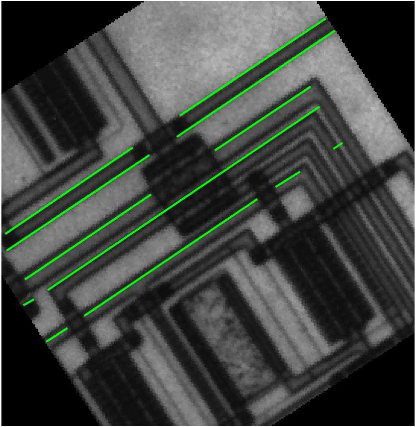
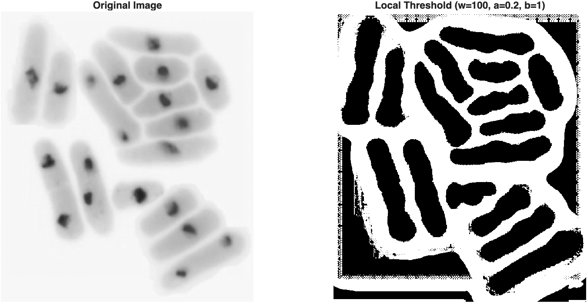

# Lab 5 - Segmentation and Feature Detection
*_Peter Cheung, version 1.2, 19 Feb 2026_*


In this laboratory session, you will explore techniques to identify features and regions in an image. As before, clone this repository to your laptop and keep your experimental logbook on your repo.  

## Task 1: Point Detection

The file "crabpulsar.tif" contains an image of the neural star Crab Nebula, which was the remnant of the supernova SN 1054 seen on earth in the year 1054. 

The goal is to try to remove the main nebular and only highlight the surrounding stars seen in the image.

Try the following code and explain what hapens.

```
clear all
close all
f = imread('assets/crabpulsar.tif');
w = [-1 -1 -1;
     -1  8 -1;
     -1 -1 -1];
g1 = abs(imfilter(f, w));     % point detected
se = strel("disk",1);
g2 = imerode(g1, se);         % eroded
threshold = 100;
g3 = uint8((g2 >= threshold)*255); % thresholded
montage({f, g1, g2, g3});
```

>First a point detection filter (laplacian) keeps only the distinct points. It does so by summing the 8 surrounding pixels and summing it with 8X the center pixel's value, only outputting a value if the surrounding pixels are quite different from the center pixel. Then the points (including both tiny noise, and larger actual stars), are eroded to leave only the actual stars. Lastly, thresholding above value 100 is used to leave only bright points where stars shine bright.

## Task 2: Edge Detection 

Matlab Image Processing Toolbox provides a special function *_edge( )_* which returns an output image containing edge points.  The general format of this function is:

```
[g, t] = edge(f, 'method', parameters)
```
*_f_* is the input image.  
*_g_* is the output image.  *_t_* is an optional return value giving the threshold being used in the algorithm to produce the output.  
*_'method'_* is one of several algorithm to be used for edge detection.  The table below describes three algorithms we have covered in Lecture 8.

<p align="center">  </p>

The image file *_'circuits.tif'_* is part of a chip micrograph for an intergrated circuit.  The image file *_'brain_tumor.jpg'_* shows a MRI scan of a patient's brain with a tumor.

Use *_function edge( )_* and the three methods: Sobel, LoG and Canny, to extract edges from these two images.

The function *_edge_* allows the user to specify one or more threshold values with the optional input *_parameter_* to control the sensitivity to edges being detected.  The table below explains the meaning of the threshold parameters that one may use.

<p align="center">  </p>

Repeat the edge detection exercise with different threshold to get the best results you can for these two images.

<p align="center">  </p>

>From left to right: base, sobel, LoG, Canny\
>From top to bottom: default thresholds, default thresholds, custom thresholds, custom thresholds\
> I focused on trying to improve the brain MRI, but it seems perhaps that image isn't very suitable for log or sobel edge detection... The canny edge detection was improved though.
>
>Values:\
>thresh_sobel = 0.05;\
>thresh_log = 0.005;\
>thresh_canny = [0.1, 0.2];


## Task 3 - Hough Transform for Line Detection

In this task, you will be lead through the process of finding lines in an image using Hough Transform.  This task consists of 5 separate steps.


#### Step 1: Find edge points
Read the image from file 'circuit_rotated.tif' and produce an edge point image which feeds the Hough Transform.

```
% Read image and find edge points
clear all; close all;
f = imread('assets/circuit_rotated.tif');
fEdge = edge(f,'Canny');
figure(1)
montage({f,fEdge})
```
This is the same image as that used in Task 2, but rotated by 33 degrees.

#### Step 2: Do the Hough Transform
Now perform the Hough Transform with the function *_hough( )_* which has the format:
```
[H, theta, rho] = hough(image)
```
where *_image_* is the input grayscale image, *_theta_* and *_rho_* are the angle and distance in the transformed parameter space, and *_H_* is the number of times that a pixel from the image falls on this parameter "bin".  Therefore, the bins at (theta,rho) coordinate with high count values belong to a line.  (See Lecture 8, slides 19-25.)  The diagram below shows the geometric relation of *_theta_* and *_rho_* to a straight line.

<p align="center">  </p>

Now perform Hough Transform in Matlab:
```
% Perform Hough Transform and plot count as image intensity
[H, theta, rho] = hough(fEdge);
figure(2)
imshow(H,[],'XData',theta,'YData', rho, ...
            'InitialMagnification','fit');
xlabel('theta'), ylabel('rho');
axis on, axis normal, hold on;
```

The image, which I shall called the **_Hough Image_**, correspond to the counts in the Hough transform parameter domain with the intensity representing the count value at each bin.  The brighter the point, the more edge points maps to this parameter.  Therefore all edge points on a straight line will map to this parameter bin and increase its brightness.

#### Step 3: Find peaks in Hough Image
Matlab  provides a special function **_houghpeaks_** which has the format:
```
peaks = houghpeaks(H, numpeaks)
```
which returns the coordinates of the highest *_numpeaks_* peaks. 

The following Matlab snippet find the 5 tallest peaks in H and return their coordinate values in *_peaks_*.  Each element in *_peaks_* has values which are the indices into the *_theta_* and *_rho_* arrays.  

The *_plot_* function overlay on the Hough image red circles at the 5 peak locations.

```
% Find 5 larges peaks and superimpose markers on Hough image
figure(2)
peaks  = houghpeaks(H,5);
%peaks  = houghpeaks(H,5,'threshold',ceil(0.3*max(H(:))));
x = theta(peaks(:,2)); y = rho(peaks(:,1));
plot(x,y,'o','color','red', 'MarkerSize',10, 'LineWidth',1);
```

> Explore the contents of array *_peaks_* and relate this to the Hough image with the overlay red circles.

#### Step 4: Explore the peaks in the Hough Image
It can be insightful to take a look at the Hough Image in a different way.  Try this:

```
% Plot the Hough image as a 3D plot (called SURF)
figure(3)
surf(theta, rho, H);
xlabel('theta','FontSize',16);
ylabel('rho','FontSize',16)
zlabel('Hough Transform counts','FontSize',16)
```
You will see a plot of the Hough counts in the parameter space as a 3D plot instead of an image.  You can use the mouse (or track pad) to rotate the plot in any directions and have a sense of where the peaks occurs.  The **_houghpeak_** function simply search this profile and fine the highest specified number of peaks.  

### Step 5: Fit lines into the image

The following Matlab code uses the function **_houghlines_** to 

```
% From theta and rho and plot lines
lines = houghlines(fEdge,theta,rho,peaks,'FillGap',5,'MinLength',7);
figure(4), imshow(f), 
figure(4); hold on
max_len = 0;
for k = 1:length(lines)
   xy = [lines(k).point1; lines(k).point2];
   plot(xy(:,1),xy(:,2),'LineWidth',2,'Color','green');
```

The function **_houghlines( )_** returns arrays of lines, which is a structure including details of line segments derived from the results from both **_hough_** and **_houghpeaks_**.  Details are given in the table below.

<p align="center">  </p>

The start and end coordinates of each line segment is used to define the starting and ending point of the line which is plotted as overlay on the image.

> How many line segments are detected? Why it this not 5, the number of peaks found?

<p align="center">  </p>

>>Originally multiple segments are detected along 5 lines. 

> Explore how you may detect more lines and different lines (e.g. those orthogonal to the ones detected).

<p align="center">  </p>

>> I increased the FillGap from 5 -> 15, and increased the number of peaks to 10. This adds orthogonal lines (as originally all the top lines were parallel, so just adding in the 6th - 10th place options included some of the weaker orthogonal lines). Increasing the FillGap helped make lines more contiguous.


> Optional: Matlab also provides the function **_imfindcircles( )_**, which uses Hough Transform to detect circles instead of lines.  You are left to explore this yourself.  You will find two relevant image files for cicle detection: *_'circles.tif'_* and *_eight.png_* in the *_assets_* folder.

## Task 4 - Segmentation by Thresholding

You have used Otsu's method to perform thresholding using the function **_graythresh( )_** in Lab 3 Task 3 already.  In this task, you will explore the limitation of Otsu's method.

You will find in the *_assets_* folder the image file *_'yeast_cells.tif'_*. Use Otu's method to segment the image into background and yeast cells.  Find an alternative method to allow you separating those cells that are 'touching'. (See Lecture 9, slide 9.)

> Using Otsu's method to threshold:
<p align="center">  </p>

> Using Standard Deviation Thresholding to threshold:
<p align="center">  </p>

> Nice and clean for connected body counting (if we ever needed to)

## Task 5 - Segmentation by k-means clustering

In this task, you will learn to apply k-means clustering method to segment an image.  

Try the following Matlab code:
```
clear all; close all;
f = imread('assets/baboon.png');    % read image
[M N S] = size(f);                  % find image size
F = reshape(f, [M*N S]);            % resize as 1D array of 3 colours
% Separate the three colour channels 
R = F(:,1); G = F(:,2); B = F(:,3);
C = double(F)/255;          % convert to double data type for plotting
figure(1)
scatter3(R, G, B, 1, C);    % scatter plot each pixel as colour dot
xlabel('RED', 'FontSize', 14);
ylabel('GREEN', 'FontSize', 14);
zlabel('BLUE', 'FontSize', 14);
```

This code reproduces the scatter plot in Lecture 9 slide 12, but in higher resolution.  Each dot and its colour in the plot corresponds to a pixel with it [R G B] vector on the XYZ axes.  The Matlab function **_scatter3( )_** produces the nice 3D plot.  
The first three inputs R, G and B are the X, Y and Z coordinates. The fourth input '1' is the size of the circle (i.e. a dot!).  The final input  is the colour of each pixel.

Note that **_scatter3( )_** expects the X, Y and Z coordinates to be 1D vectors.  Therefore the function **_reshape( )_** was used to convert the 2D image in to 1D vector.
> You can use the mouse or trackpad to move the scatter plot to different viewing angles or to zoom into the plot itself. Try it.

Matlab provides a built-in function **_imsegkmeans_** that perform k-means segmentation on an image.  This is not a general k-means algorithm in the sense that it expects the input to be a 2D image of grayscale intensity, or a 2D image of colour.  The format is:

```
[L, centers] = imsegkmeans(I, k)
```
where **_I_** is the input image, **_k_** is the number of clusters, **_L_** is the label matrix as described in the table below.  Each element of **_L_** contains the label for the pixel in **_I_**, which is the cluster index that pixel belongs.  **_centers_** contains the mean values for the k clusters.

<p align="center">  </p>

Perform k-means clustering algorithm as shown below.

```
% perform k-means clustering
k = 10;
[L,centers]=imsegkmeans(f,k);
% plot the means on the scatter plot
hold
scatter3(centers(:,1),centers(:,2),centers(:,3),100,'black','fill');
```
The last line here superimposes a large black circle at each means colour values in the scatter plot.

> Explore the outputs **_L_** and **_centers_** from the segmentation fucntion.  Explore different value of k.

Finally, use the label matrix **_L_** to segment the image into the k colours:
```
% display the segmented image along with the original
J = label2rgb(L,im2double(centers));
figure(2)
montage({f,J})
```

The Matlab function **_labe2rgb_** turns each element in **_L_** into the segmented colour stored in **_centers_**.

> Explore different value of k and comment on the results.
> Also, try segmenting the colourful image file 'assets/peppers.png'.

## Task 6 - Watershed Segmentation with Distance Transform

Below is an image of a collections of dowels viewed ends-on. The objective is to segment this into regions, with each region containing only one dowel.  Touch dowels should also be separated.
<p align="center">  </p>
This image is  suitable for watershed algorithm because touch dowels will often be merged into one object. This is not the case with watershed segmentation.

Read the image and produce a cleaned version of binary image having the dowels as foreground and cloth underneath as background.  Note how morophological operations are used to reduce the "noise" in grayscale image.  The "noise" is the result of thresholding on the pattern of the wood.

```
% Watershed segmentation with Distance Transform
clear all; close all;
I = imread('assets/dowels.tif');
f = im2bw(I, graythresh(I));
g = bwmorph(f, "close", 1);
g = bwmorph(g, "open", 1);
montage({I,g});
title('Original & binarized cleaned image')
```
Instead of applying watershed transform on this binary image directly, a technique often used with watershed is to first calculate the distance transform of this binary image. The distance transform is simply the distance from every pixel to the nearest nonzero-valued (foreground) pixel.  Matlab provides the function **_bwdist( )_** to return an image where the intensity is the distance of each pixel to the nearest foreground (white) pixel.  

```
% calculate the distance transform image
gc = imcomplement(g);
D = bwdist(gc);
figure(2)
imshow(D,[min(D(:)) max(D(:))])
title('Distance Transform')
```
> Why do we perform the distance transform on gc and not on g?   

Note that the **_imshow_** function has a second parameter which stretches the distance transform image over the full range of the grayscale.

Now do the watershed transform on the distance image.

```
% perform watershed on the complement of the distance transform image
L = watershed(imcomplement(D));
figure(3)
imshow(L, [0 max(L(:))])
title('Watershed Segemented Label')
```
> Make sure you understand the image presented. Why is this appears as a grayscale going from dark to light from left the right? 

```
% Merge everything to show segmentation
W = (L==0);
g2 = g | W;
figure(4)
montage({I, g, W, g2}, 'size', [2 2]);
title('Original Image - Binarized Image - Watershed regions - Merged dowels and segmented boundaries')
```
> Explain the montage in this last step.

## Challenges

You are not required to complete all challenges.  Do as many as you can given the time contraints.
1. The file **_'assets/random_matches.tif'_** is an image of matches in different orientations.  Perform edge detection on this image so that all the matches are identified.  Count the matches.
   
2. The file **_'assets/f14.png'_** is an image of the F14 fighter jet.  Produce a binary image where only the fighter jet is shown as white and the rest of the image is black.
   
3. The file **_'assets/airport.tif'_** is an aerial photograph of an airport.  Use Hough Transform to extract the main runway and report its length in number of pixel unit.  Remember that because the runway is at an angle, the number of pixels it spans is NOT the dimension.  A line at 45 degree of 100 pixels is LONGER than a horizontal line of the same number of pixels.
   
4. Use k-means clustering, perform segmentation on the file **_'assets/peppers.png'_**.
